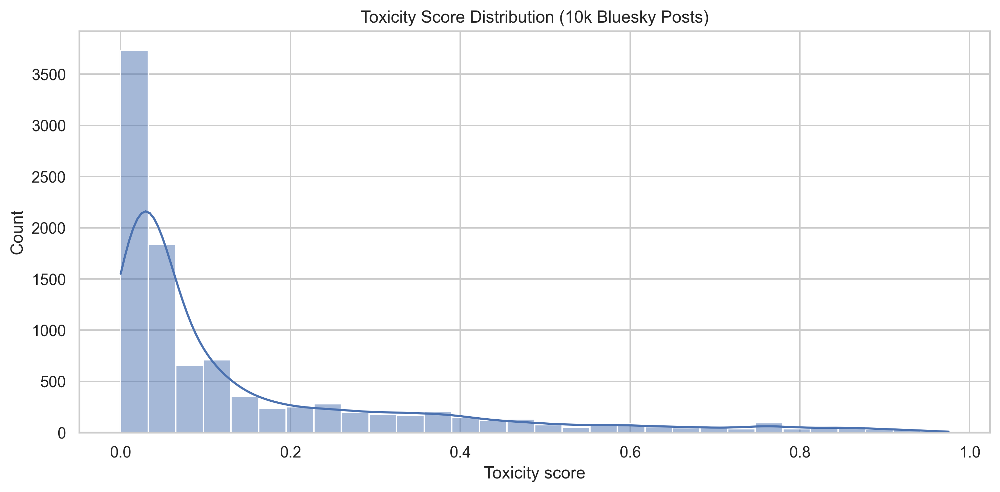
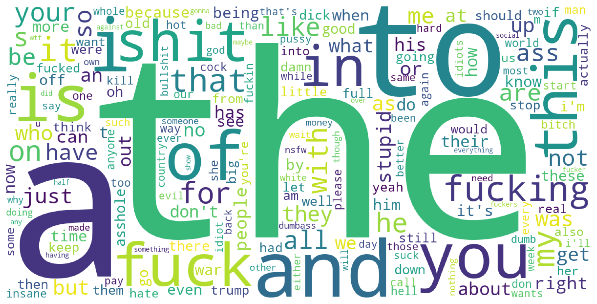

# Team td

## Team members

Tristen Davin

## Data Source

For this project, I worked with the Bluesky Firehose to get real-time posts from the Bluesky social platform. Using atproto Firehose, I ingested 100,000 posts directly into a DuckDB database. This stream of posts came in real time and included unfiltered text, replies, and original posts. After ingestion, I cleaned and filtered posts to English only, text-based, and non-emoji messages, making it easy for toxicity scoring and analysis.

## Challenges / Obstacles

Working with such a high-volume streaming source introduced plenty of challenges along the way. For one, the Firehose continuously sent data until I reached the target posts, and I ran into many bottlenecking issues when inserting records directly into DuckDB. I had to create a script that handled ConsumerTooSlow errors. Another thing that was really challenging was removing URLs, emojis, and symbols from posts during cleaning. I was eventually able to figure it out by using a regular expression to capture emojis using Unicode. One more massive challenge that I ran into was with the Google Perspective API, which only allows for 1 query/second. Initially, I planned on doing 25,000, but the quota limit meant that the task would have taken almost 7 hours, which was not feasible. I ended up taking a random sample of 10,000 of the ingested posts and intended to score these using perspective. I implemented some backoff techniques and was able to adhere to the 1 query/sec. Finally, I ran into some problems with DuckDB and Jupyter notebooks. I was getting an error that a conflicting lock was held because Jupyter notebooks often leave connections open even when you're done using them, which I was not aware of. I was able to figure out how to kill the kernel or change to read-only mode safely and confidently be able to open DuckDB again.

## Analysis

Across the 10,000 scored posts, toxicity levels were fairly low, with most posts clustered under 0.1 meaning it was skewed to the right. Only a very small fraction of posts exceed a toxicity score of 0.7, which is a good sign that toxicity is pretty rare within Bluesky, but not nonexistent. Replies and non-replies show nearly identical toxicity distributions, meaning that responding to users doesn't have a meaningful correlation with aggressive language. The scatterplot of message length vs. toxicity shows no strong linear relationship, as long messages are not consistently more toxic and toxic posts happen across all lengths. The word-frequency comparisons reveal the most about toxicity, as highly toxic posts included profanity and pronouns. On the other hand, low-toxicity posts included more neutral and conversational language. These results suggest that toxicity on Bluesky is scarce and not tied to message length or reply behavior but rather characterized more by profanity than conventional conversational structure.

## Plot / Visualization

## GitHub Repository

https://github.com/pnr3kr/bluesky_toxicity
